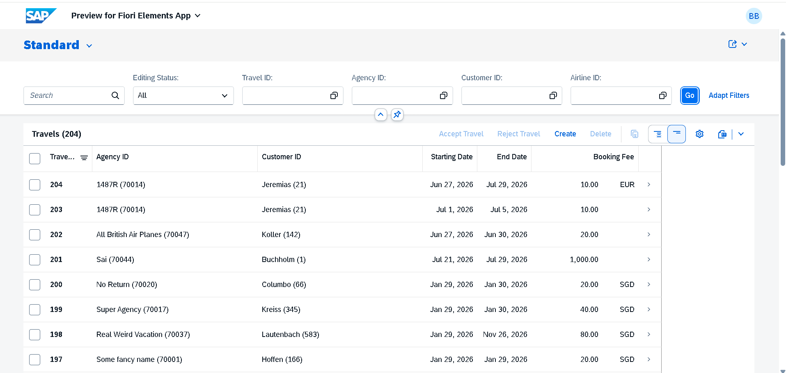
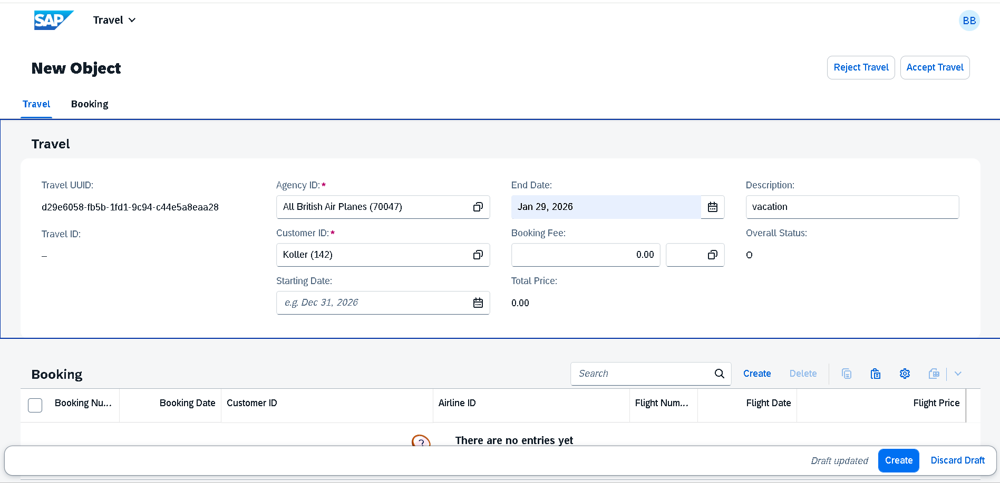
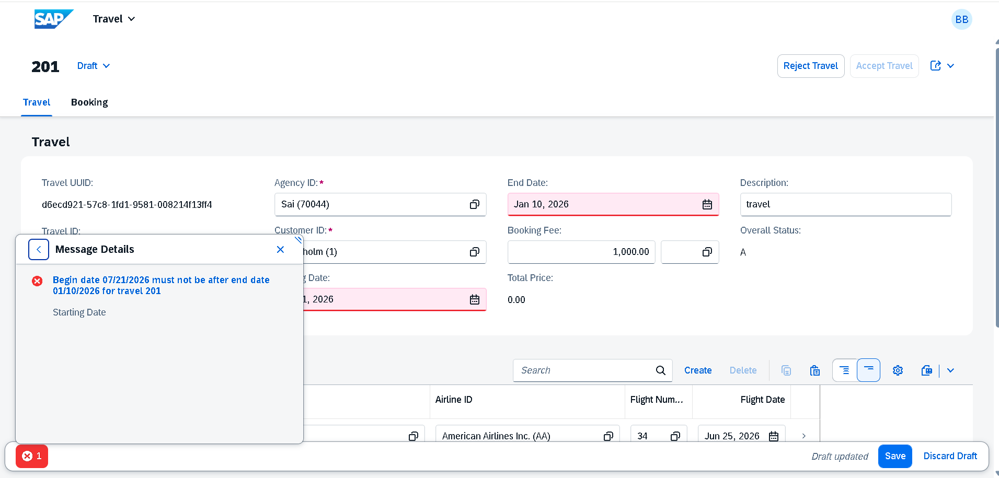
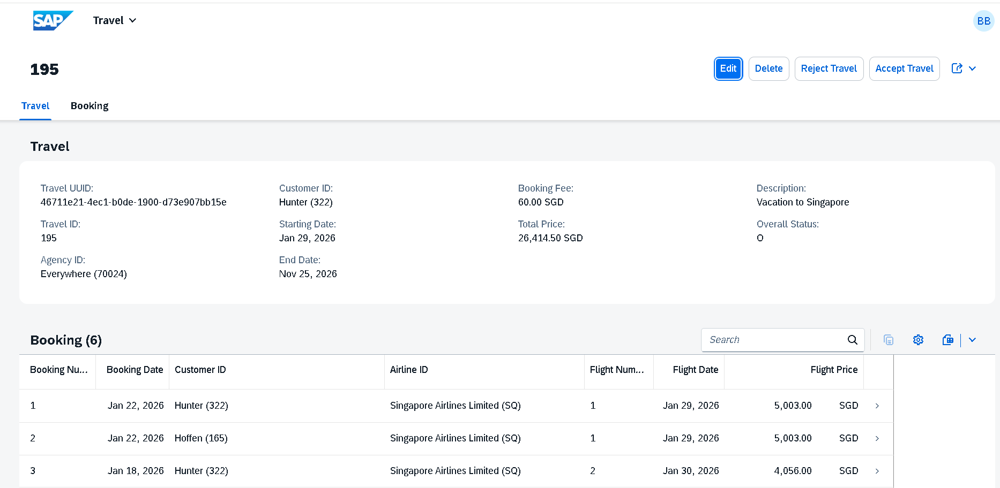
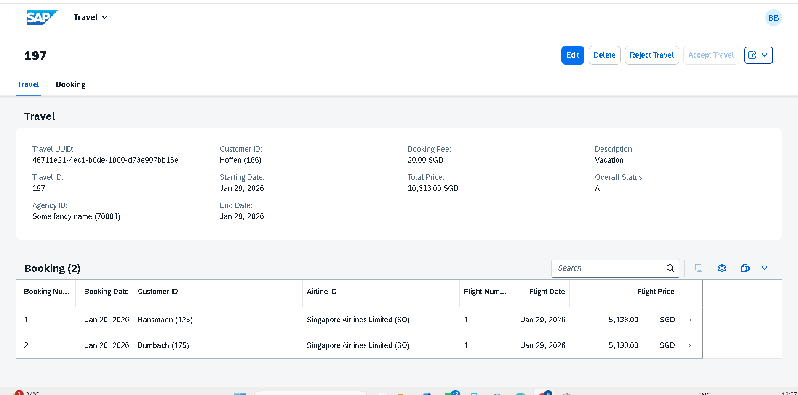
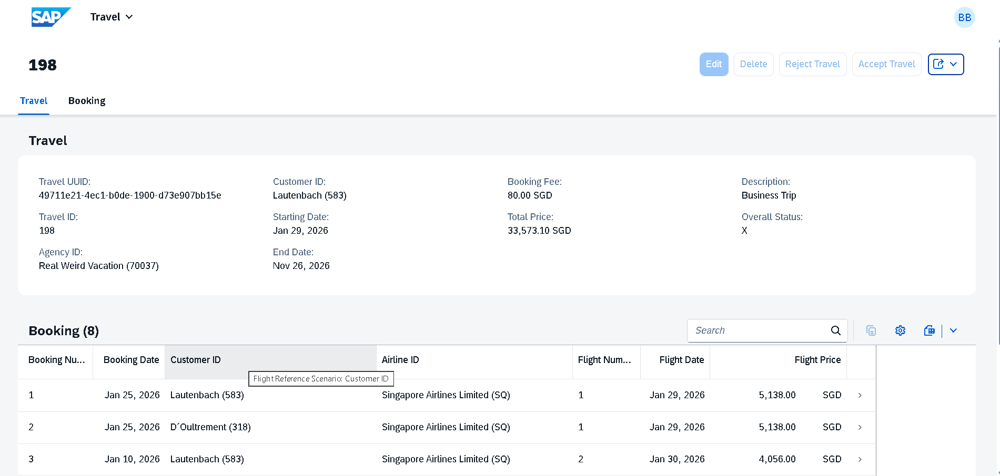

# SAP RAP Travel Management Application

## Overview

This project demonstrates the development of a draft-enabled SAP Fiori Elements application using the ABAP RESTful Application Programming Model (RAP).

The application enables users to create, update, validate, and manage travel records through a modern SAP Fiori user interface while leveraging RAP managed business objects and OData V4 services.

## Business Scenario

A travel management department requires a modern application to manage travel requests and bookings efficiently.

The solution provides draft-enabled transactional processing, business validations, custom actions, and authorization checks through a SAP Fiori Elements user experience.

## Technology Stack

* SAP S/4HANA
* ABAP RAP
* CDS Views
* OData V4
* SAP Fiori Elements
* SAP HANA
* Eclipse ADT

## Key Features

* Draft-enabled transactional processing
* Travel and booking management
* SAP Fiori Elements List Report and Object Page
* Custom actions (Accept Travel / Reject Travel)
* Business validations and determinations
* Authorization checks
* OData V4 service exposure
* End-to-end CRUD operations

## Architecture

Database Tables

↓

CDS Data Model

↓

Behavior Layer

↓

OData V4 Services

↓

SAP Fiori Elements Application

## Application Screenshots

### List Report

### Create Travel

### Validation Example

### Travel Object Page

### Accept Travel Action

### Reject Travel Action

## Key Learnings

* RAP Business Object Development
* CDS Data Modeling
* OData V4 Service Exposure
* Draft Handling
* Authorization Management
* Enterprise Application Design

## Author

Barsharani Behera

SAP ABAP Developer | RAP | SAP Fiori | CDS Views | SAP HANA
